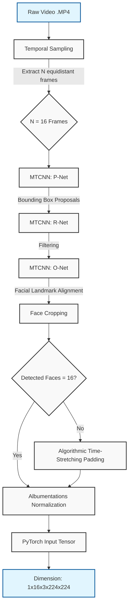
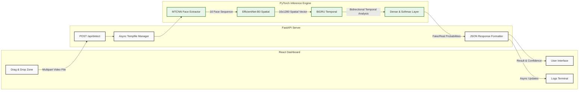

<div align="center">
  <h1>🔍 Deepfake Detector API & Dashboard</h1>
  <p><i>An Advanced Hybrid Deep Learning Architecture for Spatio-Temporal Video Forensics</i></p>

  <!-- Technologies Flags/Badges -->
  <p>
    
    
    
    
    
    
    
  </p>
</div>

---

## 📖 Project Overview

The **Deepfake Detector** is a state-of-the-art full-stack application engineered to identify AI-generated or manipulated video content. By leveraging a sophisticated hybrid neural network architecture, it combines **spatial feature extraction** (evaluating individual frame artifacts) with **temporal sequence analysis** (evaluating unnatural movements over time) to achieve high accuracy in distinguishing between genuine and deepfake videos.

This repository encompasses the entire ecosystem:
- **A highly-optimized PyTorch AI Engine**
- **An asynchronous FastAPI Backend**
- **A modern, interactive React Frontend Dashboard**

---

## 🛠️ Technologies Used

### AI & Machine Learning
- **PyTorch**: Core deep learning framework for training and inference.
- **MTCNN (Multi-task Cascaded Convolutional Networks)**: For robust face detection, alignment, and extraction.
- **EfficientNet-B0**: High-efficiency Convolutional Neural Network (CNN) used as the spatial feature extractor.
- **BiGRU (Bidirectional Gated Recurrent Unit)**: Recurrent Neural Network used for modeling temporal dependencies.
- **Albumentations**: Advanced image augmentation and normalization pipeline.
- **OpenCV & PIL**: Video and image processing.

### Backend Infrastructure
- **FastAPI**: Asynchronous Python web framework for serving the AI model via REST API.
- **Uvicorn**: Lightning-fast ASGI server.
- **Python-Multipart**: For handling raw `.mp4` video file uploads.

### Frontend Application
- **React 19 & TypeScript**: Component-based UI with strict typing.
- **Vite**: Next-generation frontend tooling for blazing-fast builds.
- **CSS3 / Drag & Drop**: Responsive, animated dashboard with real-time feedback terminals.

---

## 🧠 Architecture & Pipelines

Our system utilizes a two-stream approach handling both the *Data Preprocessing Pipeline* and the *Inference Architecture*. 

### 1. The Preprocessing Pipeline (Data Flow)
Before any video is fed into the deep learning model, it must be carefully preprocessed. We don't analyze the whole frame; we specifically target the subject's face over a timeline.



**Pipeline Breakdown:**
1. **Temporal Sampling**: From a raw `.mp4` video, we extract exactly 16 equidistant frames spanning the entire duration of the clip.
2. **Face Extraction (MTCNN)**: Each frame passes through the MTCNN cascade (P-Net, R-Net, O-Net) to detect, align, and tightly crop the faces. This removes irrelevant background noise.
3. **Temporal Padding**: If a face isn't detected in every single frame (e.g., subject turns away), we use algorithmic time-stretching to pad the sequence, ensuring we always have a strict 16-frame sequence.
4. **Normalization**: The faces are resized to `224x224` pixels and normalized using standard ImageNet mean/standard deviations via Albumentations.
5. **Tensor Creation**: The final output is a 5D PyTorch Tensor of shape `[Batch(1), Frames(16), Channels(3), Height(224), Width(224)]`.

### 2. The Hybrid Inference Architecture (EfficientNet + BiGRU)

Once the tensor is prepared, it is passed into our spatio-temporal deep learning model.



**Inference Breakdown:**
1. **Spatial Analysis (EfficientNet-B0)**: We iterate through the 16 frames. The CNN extracts visual artifacts, inconsistencies in blending, and texture anomalies. Each frame is condensed into a 1280-dimensional feature vector.
2. **Temporal Analysis (BiGRU)**: The sequence of 16 vectors (shape: `16 x 1280`) is fed into a Bidirectional GRU. The BiGRU reads the sequence forwards and backwards, looking for unnatural micro-expressions, blinking anomalies, or jerky transitions between frames.
3. **Classification (Fully Connected)**: The final hidden states of the BiGRU are passed through dense dropout layers and a Softmax activation to output the final prediction probabilities: `Fake` vs `Real`.

---

## ⚙️ System Workflow

1. **User Interaction**: The user drops a video into the React frontend.
2. **API Communication**: The frontend initiates a `multipart/form-data` POST request to FastAPI (`/api/detect`).
3. **Secure Handling**: The backend securely saves the video to an asynchronous temporary file on the server.
4. **Processing**: The AI Engine performs MTCNN extraction and Hybrid Model inference.
5. **Real-time Feedback**: Throughout this process, backend logs can be streamed or visualized in the frontend terminal to keep the user informed of the pipeline's progress.
6. **Response**: A JSON payload containing the prediction (`FAKE` or `REAL`) and a confidence percentage (e.g., `98.5%`) is returned and displayed elegantly on the dashboard.

---

## 🚀 Getting Started

### Prerequisites
- Python 3.10+
- Node.js 18+
- (Optional) CUDA-enabled GPU for faster inference.

### 1. Clone the Repository
```bash
git clone https://github.com/yPMDD/deepfake-detector.git
cd deepfake-detector
```

### 2. Backend Setup
```bash
# Create a virtual environment
python -m venv .venv
source .venv/bin/activate  # On Windows use: .venv\Scripts\activate

# Install dependencies
pip install -r requirements.txt

# Start the FastAPI server
cd src/api
uvicorn main:app --reload --port 8000
```

### 3. Frontend Setup
```bash
# Navigate to the frontend directory
cd frontend

# Install dependencies
npm install

# Start the Vite development server
npm run dev
```

### 4. Docker (Alternative)
You can deploy the entire stack using Docker Compose:
```bash
docker-compose up --build
```

---

## 📁 Repository Structure

```text
deepfake-detector/
│
├── frontend/               # React + TypeScript Web Application
│   ├── src/                # UI Components, Hooks, API calls
│   └── package.json        # Frontend Dependencies
│
├── src/                    # Backend API & PyTorch Models
│   ├── api/                # FastAPI Application & Routes
│   └── models/             # PyTorch Neural Network Definitions
│       ├── pretrained_detector.py
│       ├── efficientnet_gru.py
│       └── losses.py
│
├── scripts/                # Training & Evaluation Scripts
│   ├── train_detector.py
│   └── predict_video.py
│
├── models/checkpoints/     # Saved PyTorch .pth model weights
├── data/                   # Datasets (Ignored in Git)
├── tests/                  # PyTest Unit Tests
├── docker-compose.yml      # Docker Orchestration
├── requirements.txt        # Python Dependencies
└── README.md               # Documentation
```

---

## 📄 License
This project is open-source.

*Developed for the Deepfake Detection Deep Learning Project.*
